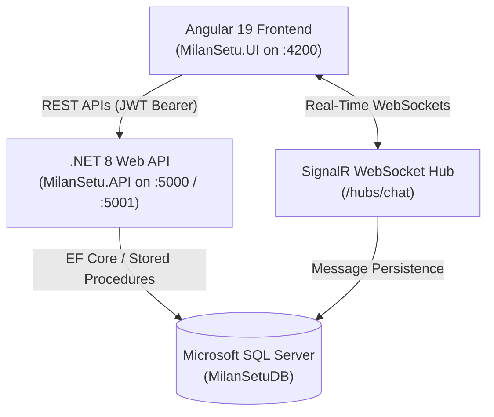
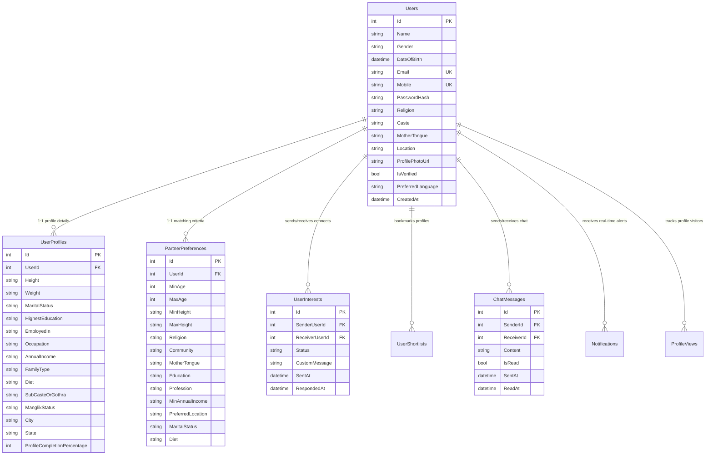

# 💍 MilanSetu (मिलनसेतु) — Modern Indian Matrimonial Platform

[](https://dotnet.microsoft.com/)
[](https://angular.dev/)
[](https://www.microsoft.com/sql-server)
[](https://dotnet.microsoft.com/apps/aspnet/signalr)
[](https://sweetalert2.github.io/)

> **MilanSetu** is a full-featured, enterprise-grade Indian Matrimony Web Application designed for modern matchmaking. Built with **.NET 8 Web API**, **Angular 19 Standalone**, **SQL Server Express**, and **SignalR**, it delivers real-time messaging, multi-language localization across 8 Indic languages, an intelligent match-scoring engine, and an intuitive UI.

---

## 📑 Table of Contents
1. [Architecture & Technology Stack](#-architecture--technology-stack)
2. [Database Schema & Table Workflows](#-database-schema--table-workflows)
3. [Stored Procedures Suite](#-stored-procedures-suite)
4. [Implemented Modules Overview](#-implemented-modules-overview)
5. [Multi-Language Support (i18n)](#-multi-language-support-i18n)
6. [Getting Started & Local Setup](#-getting-started--local-setup)
7. [API Endpoints Reference](#-api-endpoints-reference)

---

## 🏛 Architecture & Technology Stack



- **Frontend**: Angular 19 (Standalone Components, RxJS, Bootstrap 5, Bootstrap Icons, SweetAlert2, Custom TranslatePipe).
- **Backend**: ASP.NET Core 8 Web API, Entity Framework Core 8, ASP.NET Core SignalR, BCrypt password hashing, JWT Bearer Token Auth.
- **Database**: Microsoft SQL Server 2019/2022 (`MilanSetuDB`) with clustered primary keys, composite search indexes, foreign keys, and optimized stored procedures.

---

## 🗄 Database Schema & Table Workflows

The database consists of 9 core relational tables designed for fast search, indexing, and real-time operations.



### Table Workflow Summary:
1. **`Users`**: Holds credentials, JWT claims, basic demographics, verification status, and language preference (`en`, `hi`, `mr`, `bn`, `ta`, `te`, `gu`, `kn`).
2. **`UserProfiles`**: Stores the 11 detailed sections (Basic, About, Education, Profession, Income, Family, Lifestyle, Hobbies, Horoscope/Kundali, Location, Photos).
3. **`PartnerPreferences`**: Stores 11 filtering rules evaluated by the algorithm for live matchmaking compatibility scores (0-100%).
4. **`UserInterests`**: State machine (`Pending` -> `Accepted` / `Declined` / `Withdrawn`). Unlocks contact details and messaging when `Accepted`.
5. **`UserShortlists`**: Quick bookmark list for easy revisit.
6. **`ChatMessages`**: SignalR persistence with read timestamps and message ordering.
7. **`Notifications`**: Real-time push alerts for interests, views, and verification changes.
8. **`ProfileViews`**: Analytics log tracking profile views.
9. **`PasswordResetOtps`**: 6-digit cryptographic OTPs with 10-minute validity.

---

## ⚡ Stored Procedures Suite

All database scripts are available in the [`/Database`](file:///e:/Work/MilanSetu/Database) folder:

| Script File | Purpose |
| :--- | :--- |
| [`00_Full_MilanSetu_Master_Script.sql`](file:///e:/Work/MilanSetu/Database/00_Full_MilanSetu_Master_Script.sql) | Single-file complete database initialization (Tables, Indexes, Stored Procedures). |
| [`01_MilanSetu_Schema_Tables_Indexes.sql`](file:///e:/Work/MilanSetu/Database/01_MilanSetu_Schema_Tables_Indexes.sql) | DDL for all 9 tables and composite performance indexes. |
| [`02_MilanSetu_Stored_Procedures.sql`](file:///e:/Work/MilanSetu/Database/02_MilanSetu_Stored_Procedures.sql) | Stored Procedures (`sp_RegisterUser`, `sp_GetUserFullProfile`, `sp_SearchMatrimonyProfiles`, `sp_SendInterest`, `sp_RespondInterest`, `sp_ToggleShortlist`, `sp_GetChatHistory`, `sp_SendMessage`). |
| [`03_MilanSetu_Seed_Data.sql`](file:///e:/Work/MilanSetu/Database/03_MilanSetu_Seed_Data.sql) | Realistic seed dataset with profiles across Indian states, religions, and professions. |

---

## 🚀 Implemented Modules Overview

1. **Module 1: Home Page & Quick Search**: Hero banner, quick matrimony finder widget, success stories, and trust highlights.
2. **Module 2: Registration**: Step-by-step registration with client and server validations, bcrypt hashing.
3. **Module 3: Authentication & Security**: JWT bearer authentication, Forgot Password flow, and 6-digit OTP verification.
4. **Module 4: My Profile**: 11 structured sections with live profile completion meter (0-100%).
5. **Module 5: Partner Preferences**: 11 partner criteria with real-time match count estimator.
6. **Module 6: Advanced Profile Search**: Multi-filter search (Age, Religion, Caste, Mother Tongue, State/City, Profession, Education) with Grid/List view and Matrimony ID search.
7. **Module 7: Matchmaking Engine & Dashboard**: Compatibility algorithm scoring candidate profiles across Age, Religion, Location, Diet, and Education with categorized tabs (*Recommended*, *New*, *Near Me*, *Visitors*, *Shortlisted*).
8. **Module 8: Express Interest & Connect**: Send Interest with optional personalized note, Accept/Decline flow, and unlocked contact information.
9. **Module 9: Shortlist Management**: Dedicated shortlist view with instant add/remove actions.
10. **Module 10: Real-Time SignalR Chat**: Instant 1-on-1 chat, typing indicators, read receipts, icebreaker conversation starters, and conversation history.
11. **Module 11: Notifications Center**: Live popover dropdown with unread badge counter and categorized alerts.
12. **Module 12: Multi-Language Support (i18n)**: 8 languages (English, Hindi, Bengali, Marathi, Tamil, Telugu, Gujarati, Kannada) with instant UI switching and database persistence.
13. **SweetAlert2 Integration**: SweetAlert2 modals and toasts for all interactions.

---

## 🌐 Multi-Language Support (i18n)

Users can change the entire platform language via the **Language Selector** in the navbar:

```
🌐 Language: English ▼
   🇬🇧 English
   🇮🇳 हिन्दी (Hindi)
   🇮🇳 বাংলা (Bengali)
   🇮🇳 मराठी (Marathi)
   🇮🇳 தமிழ் (Tamil)
   🇮🇳 తెలుగు (Telugu)
   🇮🇳 ગુજરાતી (Gujarati)
   🇮🇳 ಕನ್ನಡ (Kannada)
```

The selected language is saved in `localStorage` and automatically synchronized to `Users.PreferredLanguage` in SQL Server.

---

## 🛠 Getting Started & Local Setup

### 1. Database Setup
1. Open SQL Server Management Studio (SSMS) or Azure Data Studio.
2. Execute [`Database/00_Full_MilanSetu_Master_Script.sql`](file:///e:/Work/MilanSetu/Database/00_Full_MilanSetu_Master_Script.sql).
3. (Optional) Run [`Database/03_MilanSetu_Seed_Data.sql`](file:///e:/Work/MilanSetu/Database/03_MilanSetu_Seed_Data.sql) to populate sample profiles.

### 2. Backend API (.NET 8)
```powershell
cd Backend\MilanSetu.API\MilanSetu.API
dotnet restore
dotnet build
dotnet run
```
Backend will be available at: `http://localhost:5000` (Swagger UI: `http://localhost:5000/swagger`)

### 3. Frontend UI (Angular 19)
```powershell
cd Frontend\MilanSetu.UI
npm install
npm start
```
Frontend will be available at: `http://localhost:4200`

---

## 🔑 Default Demo Accounts
| Role | Email / Identifier | Password |
| :--- | :--- | :--- |
| **Demo User 1** | `priya.sharma@example.com` | `Password@123` |
| **Demo User 2** | `aarav.patel@example.com` | `Password@123` |

---

## 📜 License
This project is proprietary and maintained for MilanSetu Matrimony platform.
