# 💍 MilanSetu Matrimony — Complete System Workflow & Architecture Manual

> **MilanSetu** is an enterprise-grade Indian Matrimony Web Application. This document provides end-to-end workflow diagrams, database architecture, communication lifecycle, and step-by-step feature execution flows.

---

## 📑 Table of Workflows
1. [High-Level System Architecture](#1-high-level-system-architecture)
2. [User Registration & Profile Initialization Flow](#2-user-registration--profile-initialization-flow)
3. [Authentication, Google OAuth & OTP Password Recovery Flow](#3-authentication-google-oauth--otp-password-recovery-flow)
4. [7-Factor Compatibility Matching Algorithm Workflow](#4-7-factor-compatibility-matching-algorithm-workflow)
5. [Express Interest, Shortlist & Mutual Match Flow](#5-express-interest-shortlist--mutual-match-flow)
6. [Real-time SignalR Chat & Messaging Flow](#6-real-time-signalr-chat--messaging-flow)
7. [Profile View & Visitor Notification Workflow](#7-profile-view--visitor-notification-workflow)
8. [Admin Control Center & Governance Workflow](#8-admin-control-center--governance-workflow)
9. [Runtime Multi-Language Localization Workflow](#9-runtime-multi-language-localization-workflow)
10. [Complete Database Schema & Relational Entity Flow](#10-complete-database-schema--relational-entity-flow)

---

## 1. High-Level System Architecture

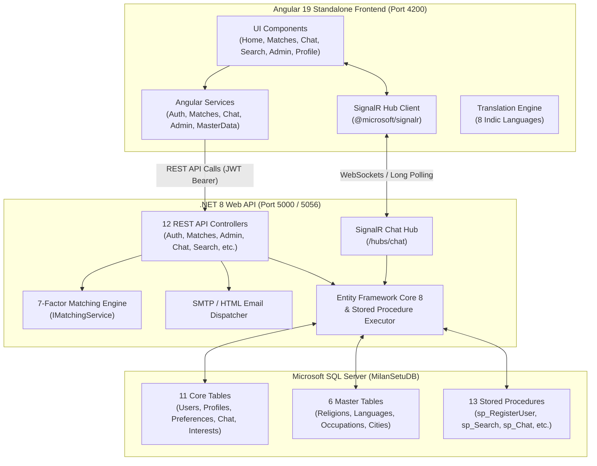

---

## 2. User Registration & Profile Initialization Flow

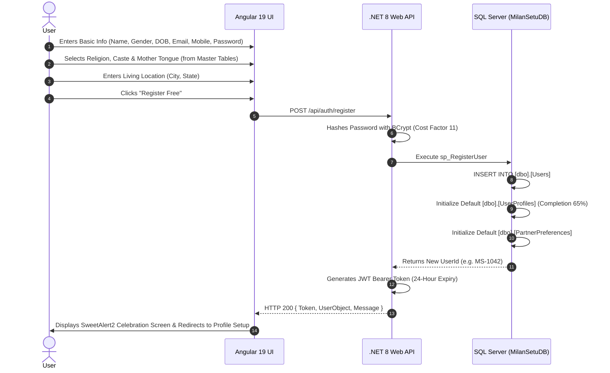

---

## 3. Authentication, Google OAuth & OTP Password Recovery Flow

### A. Google OAuth / Fast Sign-In Flow:
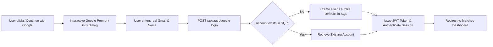

### B. Forgot Password (6-Digit Email OTP) Flow:
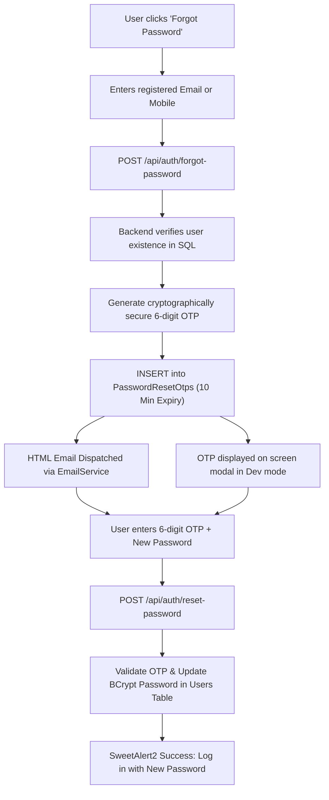

---

## 4. 7-Factor Compatibility Matching Algorithm Workflow

The platform matches registered candidates based on a weighted 100-point algorithm:

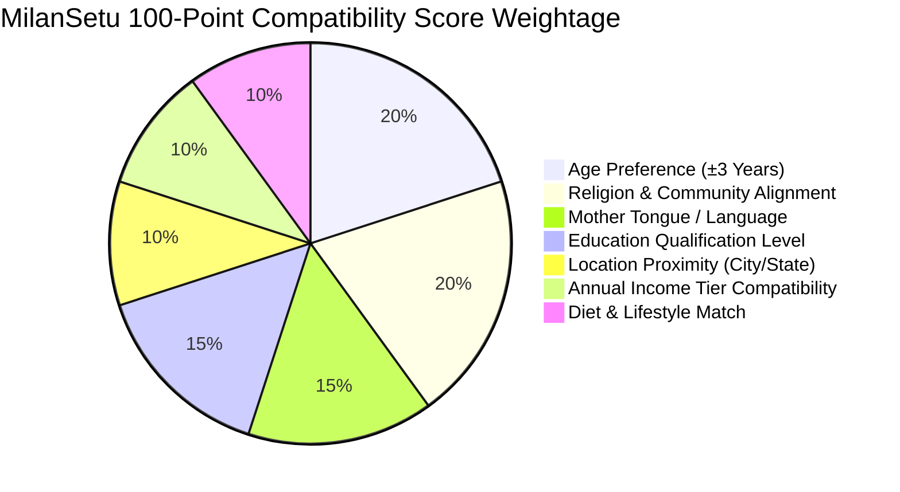

### Matching Algorithm Pipeline:
$$\text{Total Score} = S_{\text{Age}} + S_{\text{Religion}} + S_{\text{MotherTongue}} + S_{\text{Education}} + S_{\text{Location}} + S_{\text{Income}} + S_{\text{Lifestyle}}$$

- **90% - 100%**: 🌟 **Elite / Perfect Match**
- **75% - 89%**: ✨ **Highly Compatible**
- **60% - 74%**: 👍 **Good Match**
- **Below 60%**: 🔍 **Partial Match**

---

## 5. Express Interest, Shortlist & Mutual Match Flow

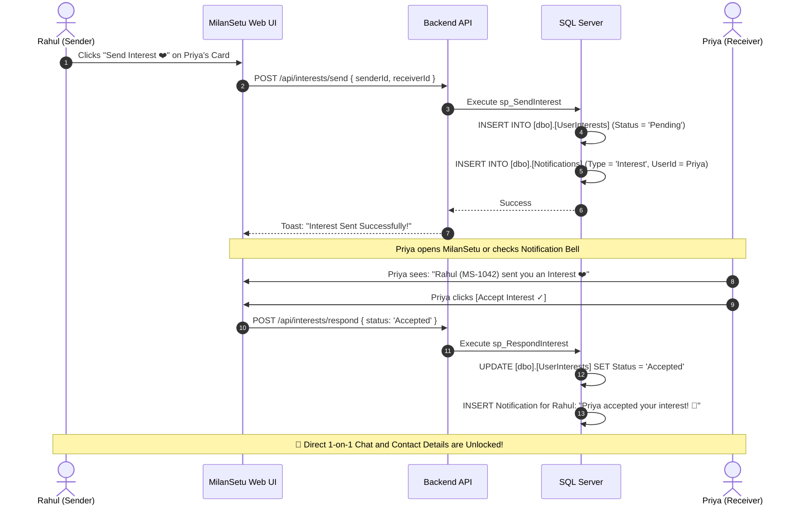

---

## 6. Real-time SignalR Chat & Messaging Flow

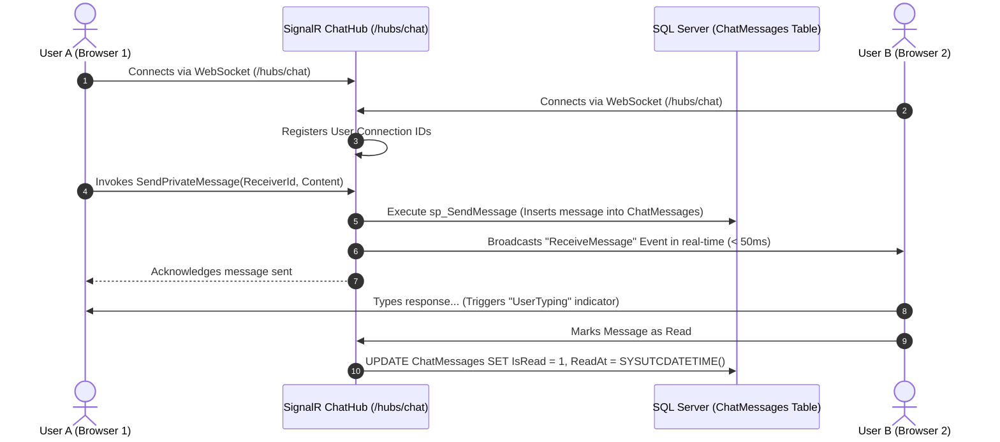

---

## 7. Profile View & Visitor Notification Workflow

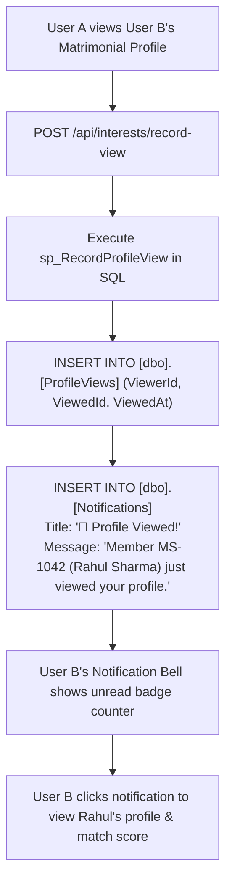

---

## 8. Admin Control Center & Governance Workflow

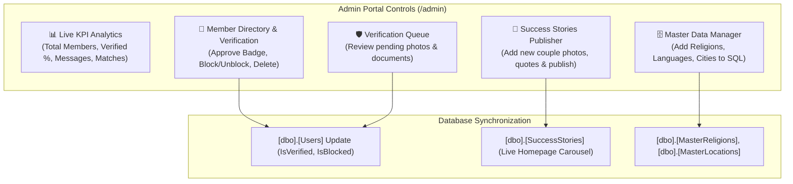

---

## 9. Runtime Multi-Language Localization Workflow

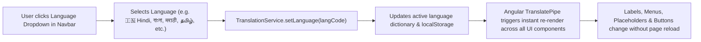

---

## 10. Complete Database Schema & Relational Entity Flow

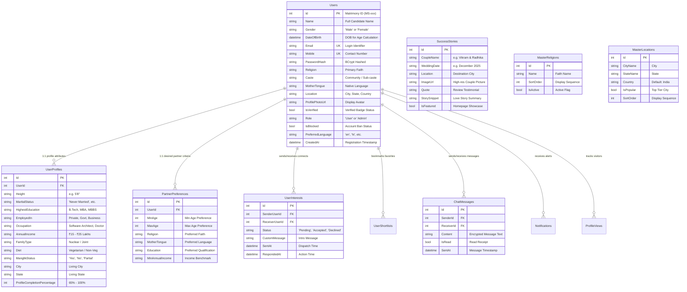

---

## 11. Summary of Execution Commands

| Component | Command | Port / URL |
| :--- | :--- | :--- |
| **Backend API** | `dotnet run --project Backend/MilanSetu.API/MilanSetu.API` | `http://localhost:5000` |
| **Frontend UI** | `npm start` (inside `Frontend/MilanSetu.UI`) | `http://localhost:4200` |
| **Admin Portal** | Access via browser | `http://localhost:4200/admin` |
| **Database Script** | Execute in SSMS | `Database/00_Full_MilanSetu_Master_Script.sql` |
